# WaveMusic App

## About
WaveMusic App is a Spotify clone application that uses the Spotify Developers API. This application was built during the Generasi GIGIH 2021 program held by Gojek's non-profit organization, Yayasan Anak Bangsa Bisa.

### Features
  - Login with Spotify account
  - User profile
  - Change theme
  - Search tracks
  - List user's playlists
  - Create new playlist
  - Playlist detail
  - List all tracks in a playlist
  - Track detail

### Stacks
  - Create-react-app, React, Typescript
  - Styling: CSS, FontAwesome Icons
  - State management: Redux
  - Testing: Jest, Testing-Library, MSW
  - Linter: ESLint
  - Deployment: Vercel

### Production
>https://wavemusic.vercel.app/

<br>

## How to use this repo
1. Clone the repo
```
git clone https://github.com/bagustambunan/generasi-gigih-homework.git
```
2. Open the dir on your terminal
```
cd generasi-gigih-homework
```
3. Fetch dependencies
```
yarn
```
4. Set up Spotify Developers API:
>https://bagustambunan.medium.com/project-menggunakan-spotify-api-di-react-js-19dbc5765a05
5. Start server:
```
yarn start
```

<br>

## Testing
Run test
```
yarn test
```

<br>

## How to use this app
WaveMusic App can run both on desktop and mobile browsers. The application will adjust the screen size used. To use the WaveMusic App, you must have a Spotify account.
<br>
You can access the WaveMusic App at the link https://wavemusic.vercel.app/

### Log in to the app
1. Click "LOG IN WITH SPOTIFY"
<br>
<table>
  <tr>
    <td>
      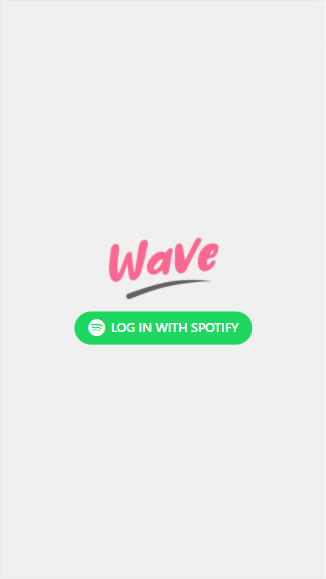
    </td>
  </tr>
</table>

2. The authentication page will appear. Please read the page, then click "AGREE"
<br>
<table>
  <tr>
    <td>
      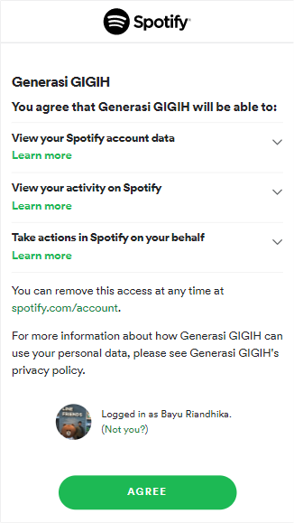
    </td>
  </tr>
</table>

3. After successful authentication, the main page of the Wave Music App will appear. You can see your profile on that page.
<br>
<table>
  <tr>
    <td>
      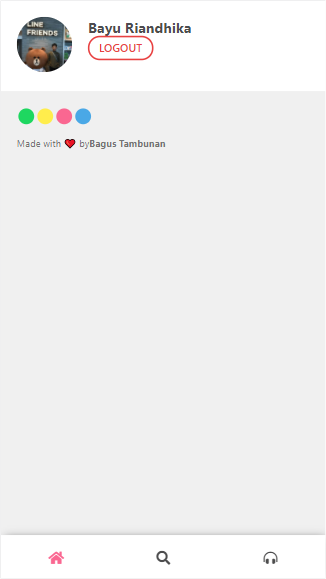
    </td>
  </tr>
</table>

### Search tracks
1. Click the search menu (magnifying glass icon) in the bottom menu.
2. Type the keyword in the search box (example: "System"), then press Enter on the keyboard and the search results will be displayed.
<br>
<table>
  <tr>
    <td>
      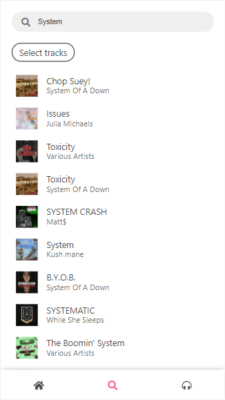
    </td>
  </tr>
</table>

### Show all your playlists
1. Click the playlist menu (headphone icon) in the bottom menu.
2. The page will show all your playlists on Spotify.
<br>
<table>
  <tr>
    <td>
      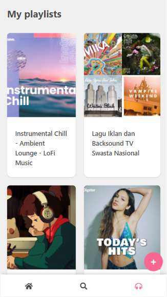
    </td>
  </tr>
</table>

### Create a new playlist
1. On the playlist page, click the + button (located in the lower right corner)
<br>
<table>
  <tr>
    <td>
      
    </td>
  </tr>
</table>

2. A page for creating a new playlist will appear. Fill in the title (minimum 10 characters) and description (minimum 20 characters). Then click "CREATE"
<br>
<table>
  <tr>
    <td>
      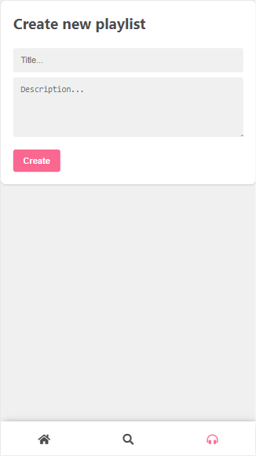
    </td>
    <td>
      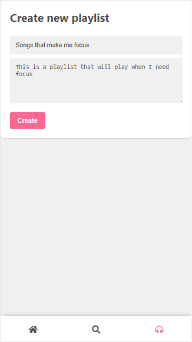
    </td>
  </tr>
</table>

3. Open the playlist page, and the newly created playlist will appear
<br>
<table>
  <tr>
    <td>
      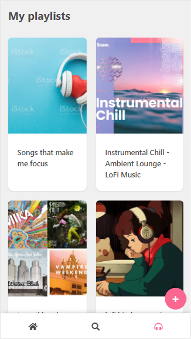
    </td>
  </tr>
</table>

4. Click the playlist, and it looks like the contents are still empty. We will add some tracks in the next step
<br>
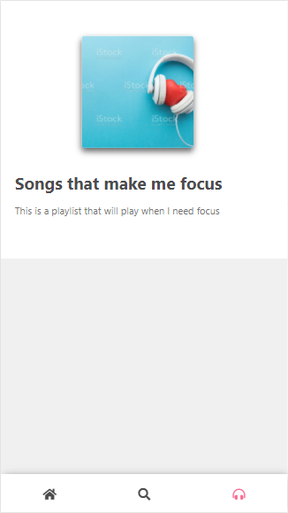

### Adding tracks to a playlist
1. Find the tracks you want on the search page
<br>
<table>
  <tr>
    <td>
      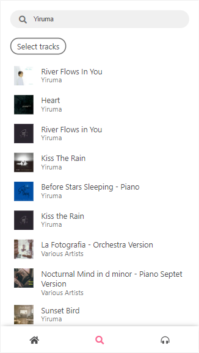
    </td>
  </tr>
</table>

2. Click "Select tracks"
<br>
<table>
  <tr>
    <td>
      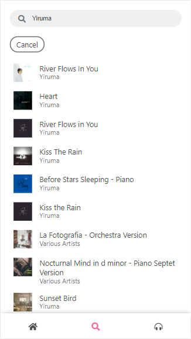
    </td>
  </tr>
</table>

1. Click the tracks you want to choose
<br>
<table>
  <tr>
    <td>
      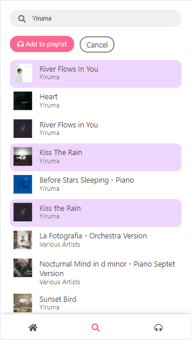
    </td>
  </tr>
</table>

4. Click "Add to playlist" then select a playlist. Click "Add" to add the tracks you have selected to the playlist
<br>
<table>
  <tr>
    <td>
      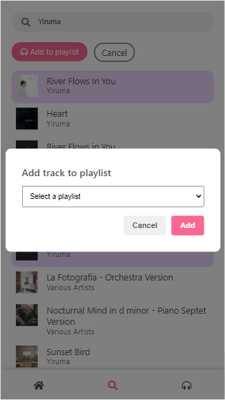
    </td>
    <td>
      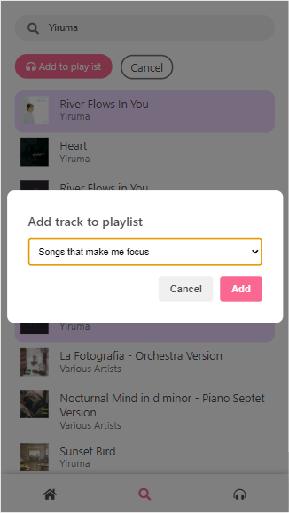
    </td>
  </tr>
</table>

5. Go to the playlist page and see that the songs have been successfully added to the playlist
<br>
<table>
  <tr>
    <td>
      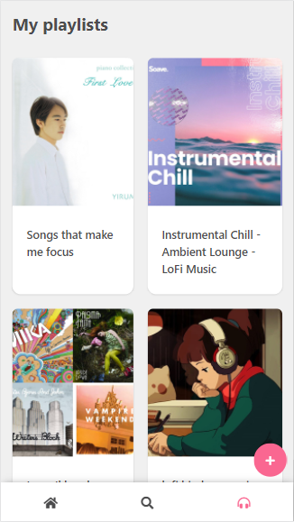
    </td>
    <td>
      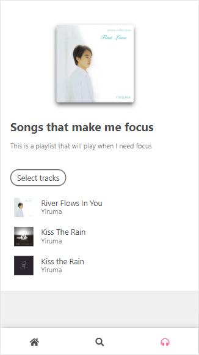
    </td>
  </tr>
</table>

### Show a track details
1. Search for the track you want to see details
<br>
<table>
  <tr>
    <td>
      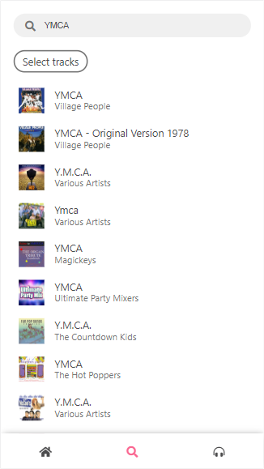
    </td>
  </tr>
</table>

2. Click on the track, and the track details page will appear
<br>
<table>
  <tr>
    <td>
      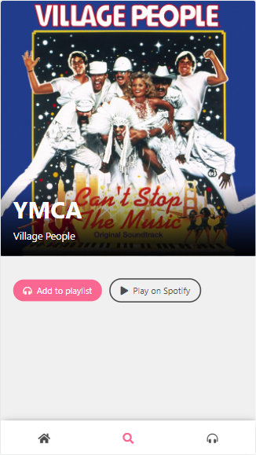
    </td>
  </tr>
</table>

3. You can add the track to a playlist by clicking "Add to playlist"

4. You can also open the track on Spotify by clicking "Play on Spotify"

### Change color theme
You can change the color theme on the home page. There are 4 choices of themes that you can choose
<br>
<table>
  <tr>
    <td>
      
    </td>
    <td>
      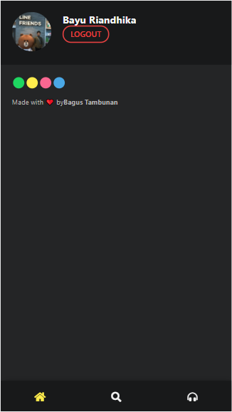
    </td>
    <td>
      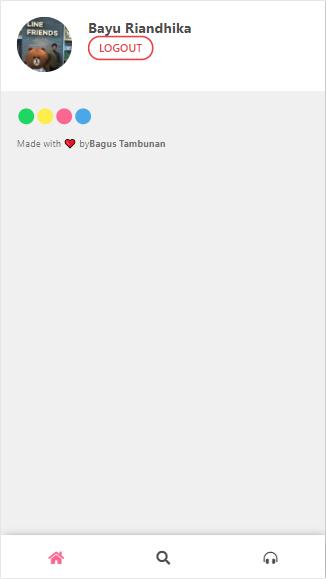
    </td>
    <td>
      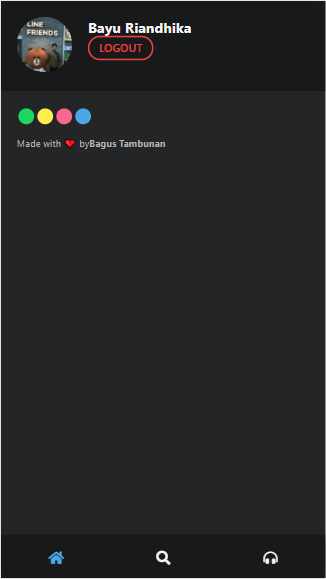
    </td>
  </tr>
</table>